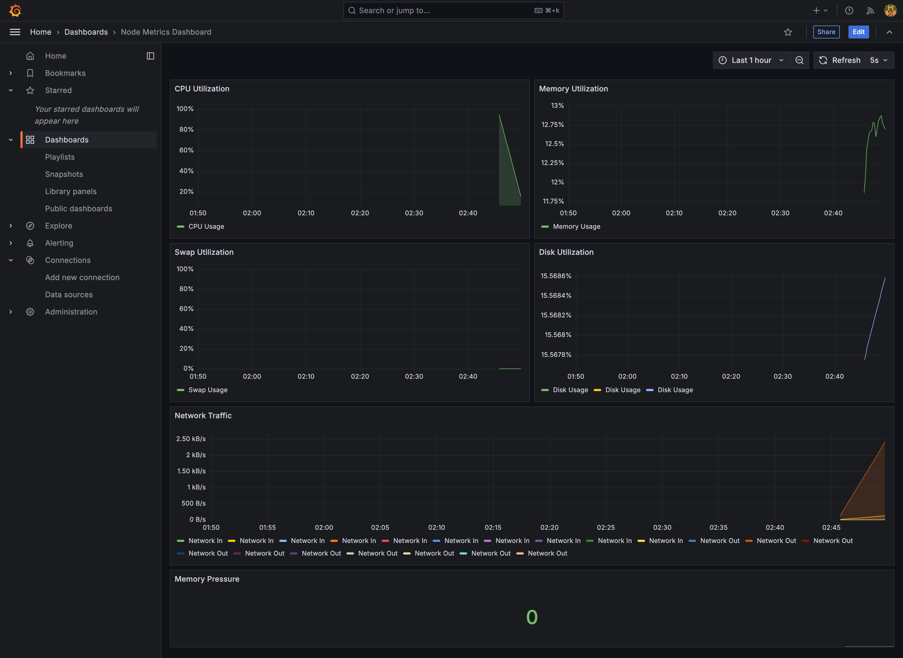

# Node Metrics Monitoring System

A comprehensive monitoring solution that combines Prometheus and Grafana to provide real-time system metrics visualization for MacOS (including M1) systems. This project sets up automated monitoring with pre-configured dashboards, making it easy to track CPU, memory, disk, and network usage.

## System Overview

This monitoring system consists of three main components working together:

1. **Prometheus**: The time-series database that collects and stores metrics data. It actively scrapes metrics from the node-exporter and applies custom recording rules for data aggregation.

2. **Node Exporter**: A Prometheus exporter specifically designed for hardware and OS metrics. It exposes detailed system metrics that Prometheus can collect.

3. **Grafana**: The visualization platform that creates beautiful, real-time dashboards from the Prometheus data. It comes pre-configured with custom dashboards for immediate use.


## Prerequisites

- Docker
- Docker Compose
- MacOS (tested on M1, but works on Intel-based systems as well)
- At least 2GB of free disk space for metrics storage

## Installation

1. Clone this repository:
```bash
git clone https://github.com/yourusername/node-metrics-monitoring.git
cd node-metrics-monitoring
```

## Dashboard Preview



Our pre-configured dashboard provides comprehensive system monitoring with:

1. **CPU Utilization**: Real-time tracking of CPU usage with color-coded thresholds for easy monitoring. The graph shows percentage utilization over time, helping you identify usage patterns and potential bottlenecks.

2. **Memory Utilization**: Monitors system memory usage, displaying both used and available memory. The graph provides clear visibility of memory consumption trends and helps prevent memory-related issues.

3. **Swap Utilization**: Tracks swap memory usage, which is particularly important for system performance monitoring. High swap usage can indicate potential memory constraints.

4. **Disk Utilization**: Shows storage usage across your system. The graph helps you proactively manage disk space and avoid storage-related problems.

5. **Network Traffic**: Displays inbound and outbound network traffic rates. This dual-metric visualization helps you monitor network performance and identify unusual patterns.

6. **Memory Pressure**: A key performance indicator showing system memory pressure, helping you identify potential memory-related performance issues before they become critical.

The dashboard features:
- Real-time updates every 5 seconds
- Color-coded thresholds for quick status assessment
- Smooth line graphs for better readability
- One-hour historical data view by default
- Dark theme for reduced eye strain
- Consistent layout for easy monitoring